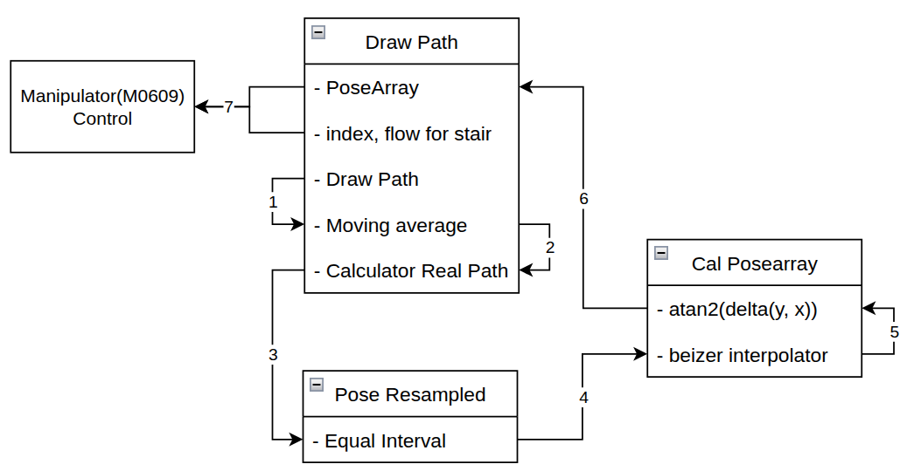

# ROS2 Drawing Pad Path Publisher

## 📌 프로젝트 개요

ROS2 기반의 실시간 2D 경로 입력/샘플링/보간/퍼블리시 툴입니다.\
마우스 드로잉으로 경로를 직접 그리고,\
OpenCV 좌표계에 맞게 변환하여 **간격이 고른 Trajectory**를\
`Float32MultiArray` 및 `PoseArray` 등 ROS2 토픽으로 publish할 수 있습니다.
또한, 높이 설정을 위한 index와 높이를 `Int32MultiArray`의 ROS2 토픽으로 publish할 수 있습니다.

- **Tkinter GUI Drawing Pad**
- **좌우반전/좌상단 원점 (OpenCV 호환 좌표계)**
- **이동평균 Smoothing, 등간격 샘플링**
- **Bezier 보간**
- **실시간 ROS2 퍼블리시 및 시각화**
  - 경로
  - 인덱스, 높이

## 🏗️ 프로젝트 구조

```
├── draw_path.py             # Tkinter 기반 경로 그리기 및 publish 노드
├── pose_resampled.py        # 등간격 샘플링 노드 (Float32MultiArray in/out)
├── cal_posearray.py         # 경로 PoseArray 변환/Publish
├── 기타 (분석용)
```

- `draw_path.py` : 2D 경로 입력 + 좌표계 변환 + publish(`PoseArray`, `Int32MultiArray`) + GUI
- `pose_resampled.py` : 입력 경로를 등간격(Uniform Interval)으로 샘플링
- `cal_posearray.py` : Yaw 계산 및 PoseArray publish


## 🚀 실행 방법

**1. ROS2 워크스페이스에서 빌드 및 활성화**

```bash
cd ~/ros2_ws/
colcon build --packages-select draw_path
source install/setup.bash
```

**2. Drawing Pad 실행**

```bash
ros2 run draw_path draw_path
```

**3. 등간격 샘플링 노드 실행**

```bash
ros2 run draw_path pose_downsample
```

**4. 경로 시각화 및 PoseArray 퍼블리시**

```bash
ros2 run draw_path draw_path.launch.py
```

**5. launch 파일 실행**

```bash
ros2 launch draw_path path_resampler.py --ros-args -p interval:=5.0
```

## 🧩 토픽 구조 예시

| 노드명                | 입력 토픽                  | 출력 토픽                   | 메시지 타입                | 설명                     |
| :------------------: | :----------------------: | :----------------------: | :----------------------: | :----------------------: |
| draw\_path.py        | (없음)                    | drawing\_path            | Float32MultiArray        | 사용자가 그린 원본 경로      |
| pose\_resampled.py   | drawing\_path            | drawing\_path\_resampled | Float32MultiArray        | 등간격(Uniform) 샘플링 결과 |
| cal\_posearray.py    | drawing\_path\_resampled | domino\_pose\_array\_GUI | geometry\_msgs/PoseArray | 보간 및 변환된 경로(GUI출력용 Pose)   |
| draw\_path.py        | domino\_pose\_array\_GUI | domino\_pose\_array      | geometry\_msgs/PoseArray | 보간 및 변환된 경로(Pose)   |
| draw\_path.py        | (없음)                | domino_pose_array_with_index | Int32MultiArray          | 계단 위치 및 높이 <br> `[index, height(stair)]`   |



## 🖥️ 사용 예시

1. Drawing Pad에서 직접 경로를 그림
2. [Publish Path] 버튼 클릭 시 `drawing_path` 토픽 publish
3. `pose_resampled.py`가 등간격으로 좌표 샘플링
4. `cal_posearray.py`에서 보간(PoseArray) 및 가시화 노드로 publish
5. `draw_path.py`에서 PoseArray를 subscribe -> Int32MultiArray와 PoseArray를 ROS2 publish

## 📝 참고/응용

- ROS2 기반 경로 플래닝/드로잉/로봇 경로제어/도미노 로봇 등 **다양한 HRI/로봇/비전 프로젝트**에서 바로 활용 가능
- 좌표계 및 좌표 처리, GUI-ROS2 통합 예제로 학습 및 응용에 추천

## 👤 Author

- 작성자: 배재성 (JaeSeong-Bae)
- Contact: github[[jsbae-RL](https://github.com/jsbae-RL)]

